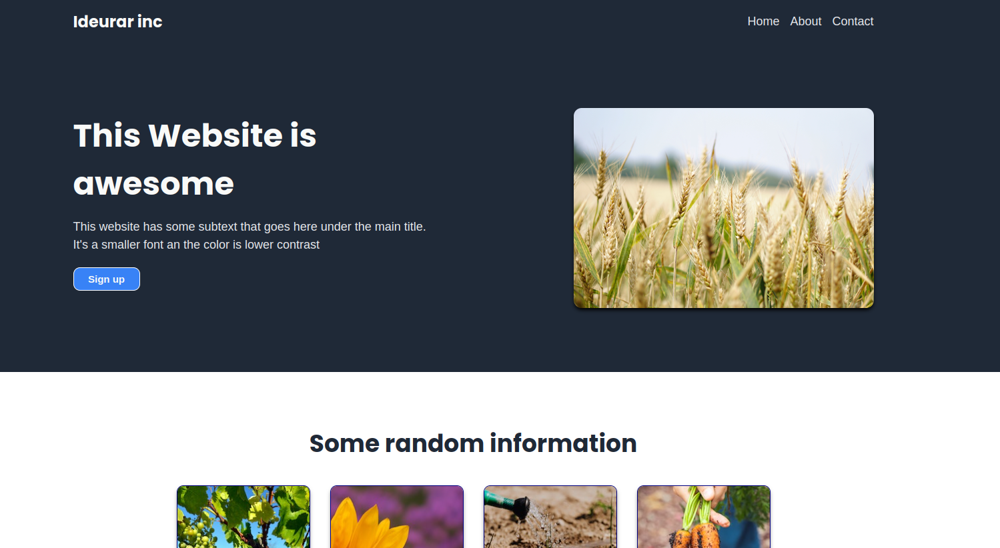

# ideurar-page: Simple Responsive Landing Page

This is a simple landing page project to practice CSS Flexbox and media queries by creating a responsive web page from a given design.

Original design challenge by [The Odin Project](https://www.theodinproject.com/lessons/foundations-landing-page)

## Demo

View the live demo: [Ideurar](https://abdellatif-bardahm.github.io/ideurar-page/)

## Features

- Responsive layout using CSS Flexbox
- Media queries for different screen sizes
- Basic, clean design

## Technologies Used

- HTML5
- CSS3 (Flexbox,Media Queries)
